# CSS Grid

CSS Grid can be used to build simple and skeletal layouts. It can also be used to create polished, professional-level layouts.

In this activity, you will use CSS Grid to re-create the design of an online furniture store.

## Instructions

### Part 1: Hero Section

Here is what we will build in this section!

  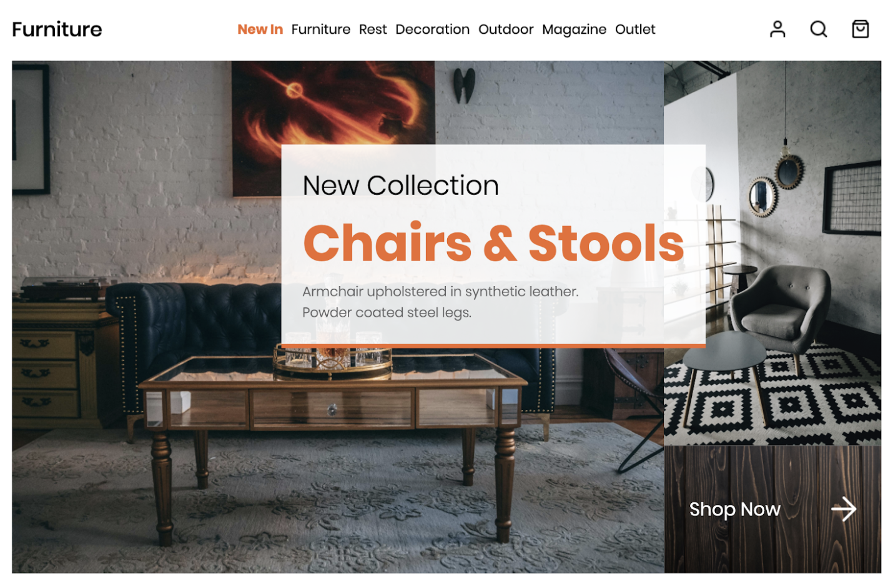

* Open the files `index.html` and `style.css`. 

  * You’ll notice that the HTML and CSS for the navigation bar code have already been completed along with some typography-related CSS.

* The HTML for the grid in the image at the beginning of this activity has already been completed. Review the HTML structure below.

  * Make sure you review the index.html activity as you write your CSS selectors.

  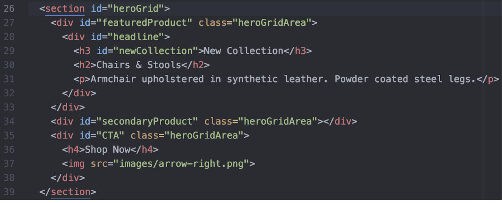

* In `style.css`, create a selector that targets the `heroGrid ID`.

  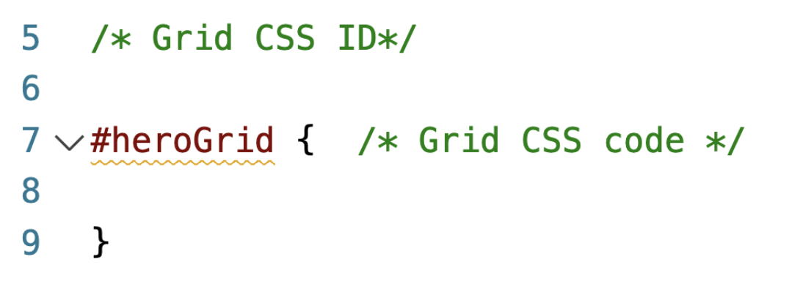

* Add the following properties to define the overall size of the grid:

  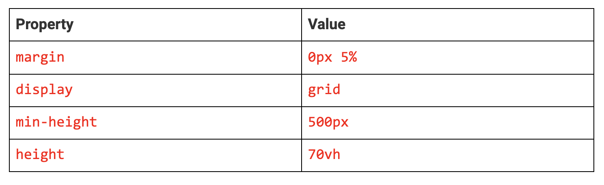

* Now that you have sized the CSS Grid, it’s time to add more CSS properties. Use the `grid-template-rows:`, `grid-template-columns:`, and `grid-template-areas`: properties to create the structure of the CSS Grid.

* The `#heroGrid` ID at the top of the page has two rows and two columns.

  * The first row and first column each occupy `75%` of their respective areas.

  * The second row and second column each occupy the remaining `25%` of their respective areas.

  * Use the values above for the `grid-template-rows:` and `grid-template-columns:` properties.

  * **CSS hint:** Do not use commas between percentages. 

* Hero grid layout visual:

  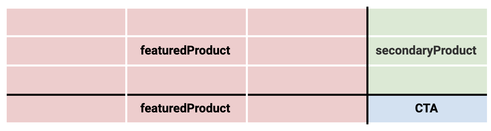

* Next, add to your CSS: `#heroGrid{ grid-template-areas: }`.

* **Hint:** The `featuredProduct` occupies the top and bottom left areas, the `secondaryProduct` is in the top right, and the `CTA` is in the bottom right.

* Add content to the CSS Grid.

  * HTML reference:

  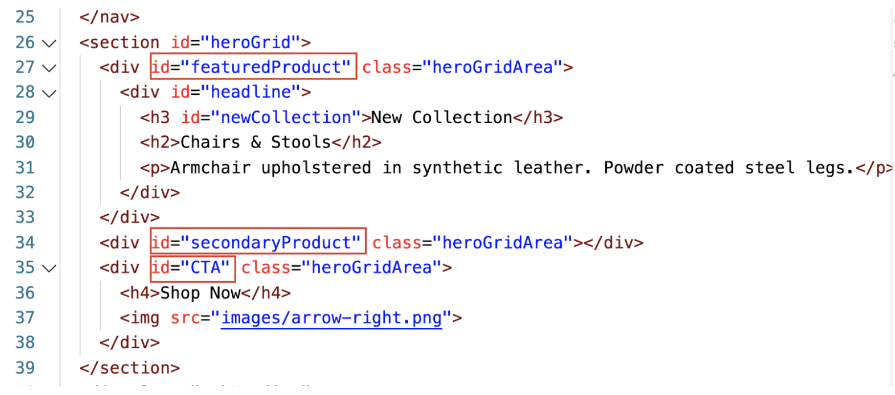

* Create three CSS selectors that target the IDs of each area within the grid from the HTML: `featuredProduct`, `secondaryProduct`, and `CTA`.

  * Within each selector, define the value for the `grid-area:` property so that each CSS selector and the CSS contained within it is associated with the correct area within the grid.

  * **Hint:** Spelling and capitalization in the syntax matter here, so pay attention.

* Add a `background-image:` to each `.heroGridArea` class selector using the images provided in the images folder.

* Add the following properties and values to the `#CTA ID` selector. These will be used to style content within this grid area.

  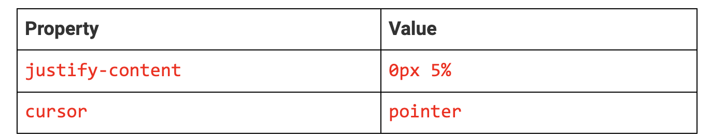

* Notice the repeated `.heroGridArea` class on each grid area in `index.html`. You can use CSS to target all instances of that class and style each instance the same way.
Create a CSS selector that targets the `.heroGridArea` class and add the following CSS properties:

  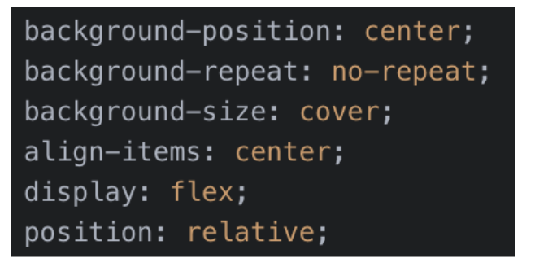

* Open `index.html` in your browser. It should almost look complete, except for the fact that the headline `div` isn’t in the right place.

* In order to align the headline `div`, add a `border: 5px solid #FF6200;`.

* Next, add a transparent `background-color:`. 

  * You could do this with a transparent image or you can use the  `rgba()` function to define red, green, blue, and alpha (opacity) values for a color.

  * Set the value for background-color to `rgba(255,255,255,0.8);`. 

  * This will set the background color to white at 80% opacity. 

* Position the headline `div` so that it’s floating above and between the `featuredProduct` and `secondaryProduct` grid areas.

* **Hint:** You will need to use `position: absolute;` along with top and right values to achieve this.

* Lastly, add a `z-index value` to move the `headline` `div` above its parent and then add `padding` to create some spacing.

* Now, finally, open index.html in your browser. You should see your final result—the grid you just built!

---

© 2022 edX Boot Camps LLC. Confidential and Proprietary. All Rights Reserved.

# CSS Grid and Breakpoints

CSS Grid can be used to build simple and skeletal layouts. It can also be used to create polished, professional-level layouts.

In this activity, you will use CSS Grid to re-create the design of an online furniture store.

## Instructions

### Part 2: Furniture Grid 

In this section, we will finish building the rest of the page!

  

* Before creating our second grid, add a `div` with the class `subHeading`.

Create an `h3` tag and add the text “Shop by Category” within this `div`.

* Next, create the HTML tags that will be our second grid under our first. Give the second grid the ID `categoryGrid`.

  * Hint: Use a `section` tag for your grid.

* Create the following HTML structure inside your newly created `section` tag. This is all the HTML structure you will need for your second grid.

  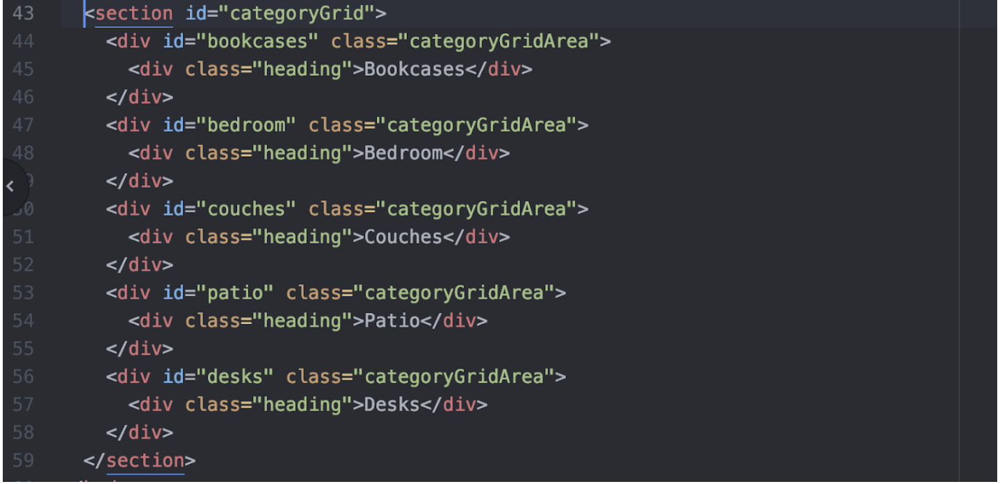

* Next, open `style.css`.  

* Create a selector that targets the `subHeading` class. Add the following:

  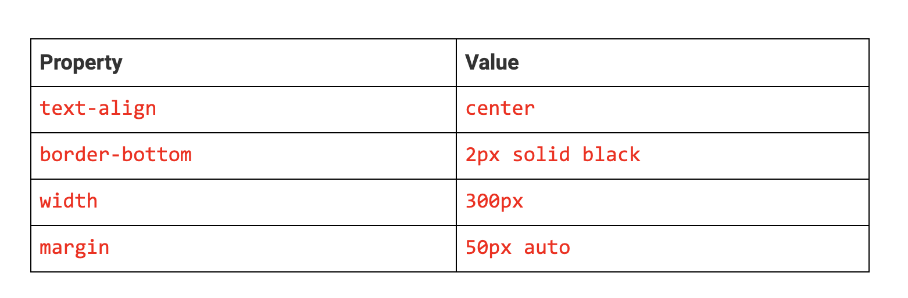

* Create a selector that targets your second grid using its ID.

* Add `margin: 0px 5%;` and `display: grid;` to create your grid.

* Use the `grid-template-rows`, `grid-template-columns`, and `grid-template-areas` properties to create the structure of the grid.

  * You will have three columns and three rows in this layout (note the illustration below).

  * Make your row `300px` tall.

  * Each column should occupy one-third of the area (use fractional units).

  * The area should look like the diagram below:

    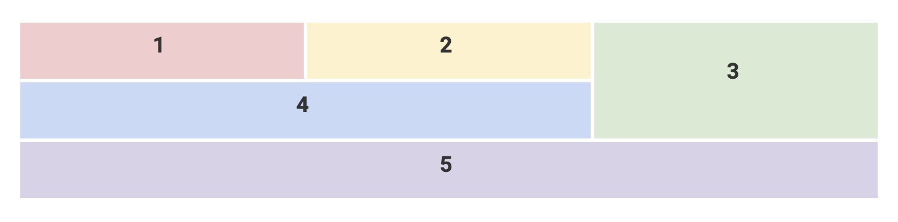

* Next, create `five selectors` that target each grid area you created in `index.html`. Remember to target the ID for each area.

* Add a `background-image` to each grid area selector using the images provided in the images folder.

* Create a selector for the common grid area class `categoryGridArea`.

* Add the following properties and values to this selector:

    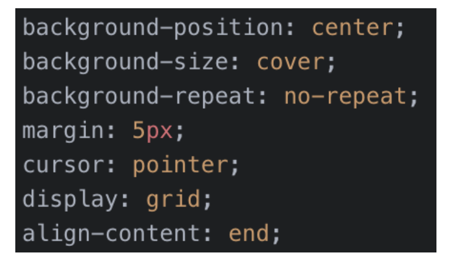

* Lastly, create a selector to target the `heading` class with the following:

    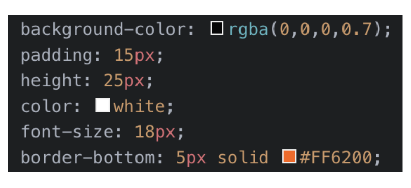
	
* Now, open `index.html` in your browser and take a look at both grids. 

* You should notice that you’ve created a great-looking layout using nested grids!

Resources

* [grid-template-rows documentation](https://www.w3schools.com/cssref/pr_grid-template-rows.asp) 

* [grid-template-columns documentation](https://www.w3schools.com/cssref/pr_grid-template-columns.asp)

---

# CSS Grid and Breakpoints

CSS Grid can be used to build simple and skeletal layouts. It can also be used to create polished, professional-level layouts.

In this activity, you will use CSS Grid to re-create the design of an online furniture store.

## Instructions

### Part 3: Responsive Breakpoint

Let's make our page responsive!

* Write a `media query` that targets a screen size with the `max-width of 1000px`.

> **Note:** You must write your CSS selectors within the media query. You’re doing it right if the selectors you’re writing are {between the media query brackets}, not outside them. 

* Correct selector placement:

  ```css 
  @media only screen and (max-width: 1000px) {
    // Your new CSS selectors go here
  }
  ``` 

* In your newly written media query, write a CSS selector that targets the `id` of `navigation`.

* In your CSS selector, give it the property `display` with a value of `none`. Write a CSS selector that targets the `class` of `icons`.

* Give the CSS selector the property `margin-left` with a value of `auto`.

* Write a `media query` that targets a screen size with the `max-width of 600px`.

* Write a CSS selector that targets the `id` of `headline`:

  * Give your selector the CSS property of `position` with a value of `static`.

  * Give your selector the CSS property of `margin` with a value of `20px`.

* Write a CSS selector that targets the `id` of `heroGrid`: 

  * Give your CSS selector the CSS property of `grid-template-areas`.

  * Rewrite the template areas so they display as follows:

    * “featuredProduct featuredProduct”
    * “secondaryProduct CTA”

  * This will cause our grid to restructure and display better on mobile devices.

* Write a CSS selector that targets the `id` of `categoryGrid`: 

  * Give your CSS selector the property of `grid-template-rows` with a value of `300px 300px 300px 300px 300px`. 

> **Note:** You need to create more rows in your grid for your content to occupy. In the previous grid’s template areas (Step 3, above), you have two rows. You will be creating five rows in your adjusted grid-template-areas.

* Give your CSS selector the property of `grid-template-columns` with a value of `1fr`.

* Give your CSS selector the CSS property of `grid-template-areas`.

* Rewrite the template areas, so they display as follows:

  * "Bookcases"

  * "Bedroom"

  * "Patio"

  * "Couches"
  
  * "Desks"

* Refresh the page. Check out your work!  

---

© 2022 edX Boot Camps LLC. Confidential and Proprietary. All Rights Reserved.
